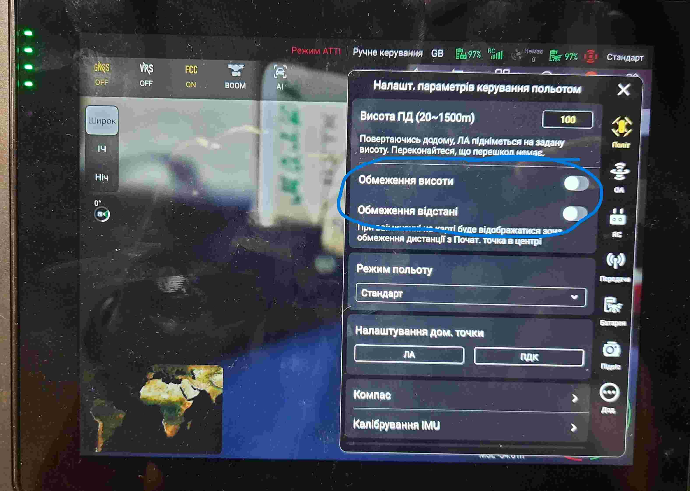
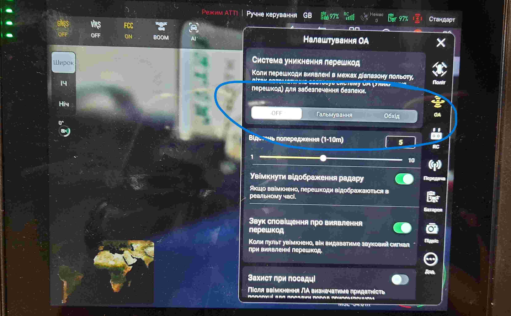
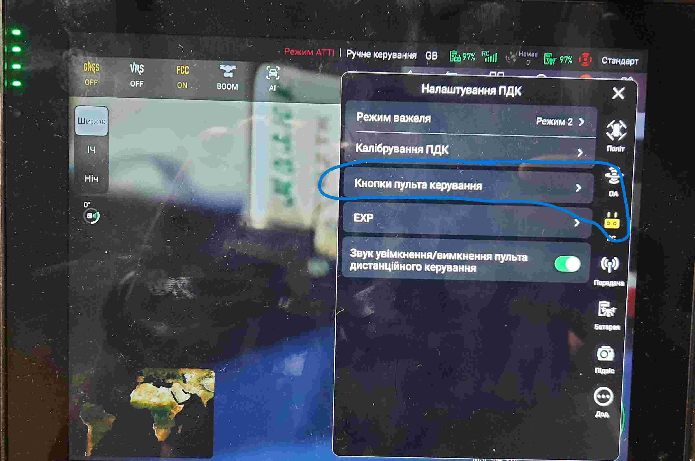
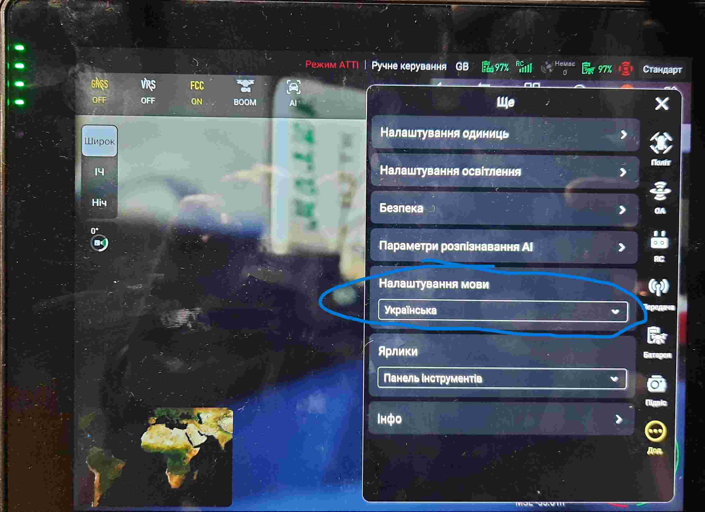

Прошивка OVERLORD
=================
Позволяет более гибко управлять частотами, и добавляет доп. функции, которых нет в оригинальной прошивке.

Поддерживаемые модели:
----------------------
Autel EVO II (V1, V2, V3)

Порядок обновления:
-------------------
1) Распаковка
  * Маркируем ящик\пульт\дрон м.лентой	
  * Заряжаем пульт через USB
  * Заряжаем батареи дрона через БП

2) Включение
  * Включаем пульт долгим нажатием
  * Включаем дрон долгим нажатием
  * Ждем биндинг (на пульте появится инфа и видео с камеры), если нет сооединения, то на пульте в левом верхнем углу нажимаем "подключить новый..", после этого на дроне кратковременно три раза нажимаем кнопку для активации режима "биндинг".

3) Обновление через ПО
  * На пульте подключаем wifi	
  * Подключаем пульт к ПК
  * Копируем updater-v2.4.3.apk (https://drive.google.com/file/d/1_CbkT867iHtFsVcJMJSRNRwmFcE6E5IF/view?usp=drive_link) в пульт
  * Инсталируем и запускаем apk
  * Вводим номер телефона с установленным signal
  * Вводим код доступа полученный в signal
  * CHECKUPDATE
  * REQUEST UPGRADE
  * UPGRADE
  * Ждем… (если прервется с ошибкой, снова запускаем upgrade)
  * Перезапускаем пульт\дрон
  * В пульте запускаем Overlord
  
4)  Доп. настройки пульта: 
       
       
       
       
            
         

5) Устанавливаем доп. apk:
* вежа, очі https://drive.google.com/file/d/1lqZg3cQuBemOd8L6wrI69ng9aYoxkI0K/view?usp=sharing
* firefox 

6) Выключение\Упаковка
  * Делаем отметки на м.ленте 			
		