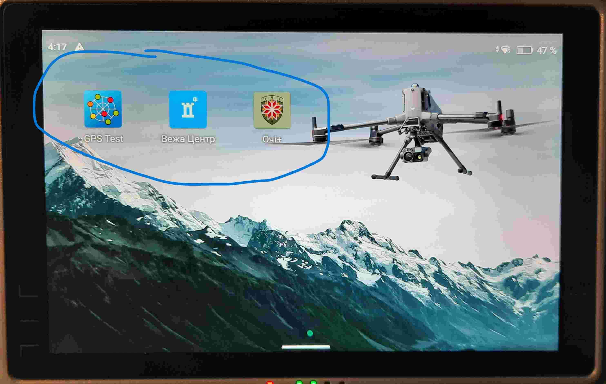
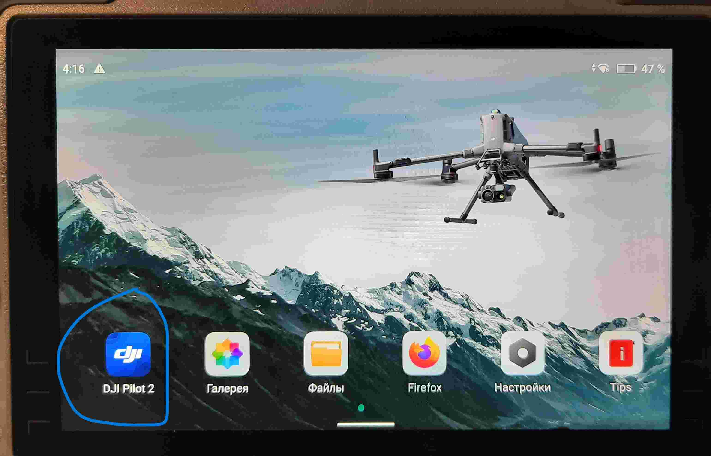
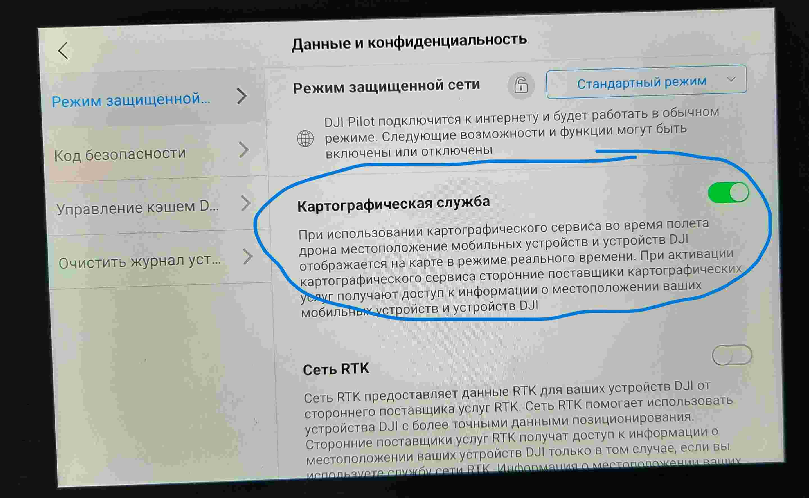
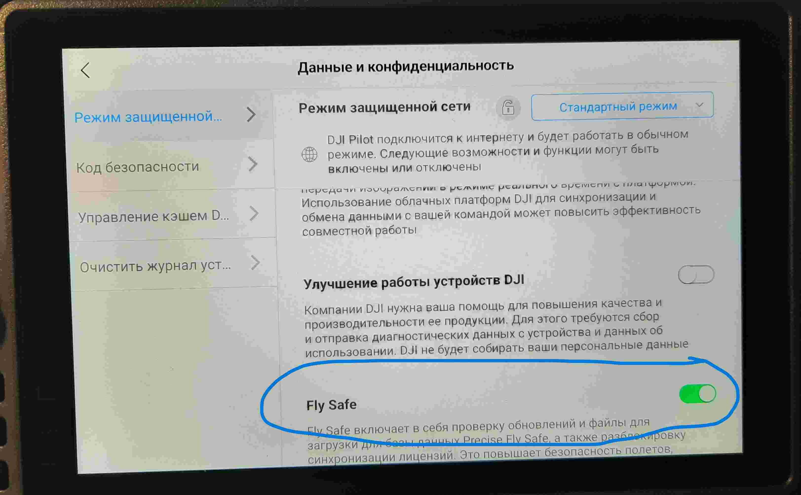

Обзор
=====
Основная процедура подготовки дронов серии DJI Matrice заключается в их анонимизации. 
Для этого аппаратно в пульте отключается датчик GPS а в дрон монтируется плата "канадка" или "монголка\австралийка". После этого ПО дрона и пульта обычно обновляется до последней версии.
Так же в программе DJI Pilot2 отключаются функции, которые потонциально, через доступ к интернету могут "светить" местоположение.

Прошивка дрона
--------------
1) Включаем питание дрона одним коротким и одним долгим нажатием
2) Подлкючаем к ПК
3) Используя программу DJI Assistant 2 (Enterprise Series) обновляем ПО дрона до последней версии

Прошивка пульта
---------------
1) Включаем пульт одним коротким и одним долгим нажатием
2) Если пульт новый, подключаем пульт к Wifi и пошагово проходим этап инициализации
3) Подключаем пульт к ПК
4) Используя программу DJI Assistant 2 (Enterprise Series) обновляем ПО пульта до последней версии
5) Устанавливаем доп. приложения (GPS Test_1.6.5_Apkpure.apk, ochi_release_1.7.31.apk, vezha-1.2.7.apk)
    
6) В приложении DJI Pilot2 перейдя в меню настроек отключаем потенциально не желательные функции:
    
    
    
    
7) Устанавливаем языки системы (Украинский, English)

