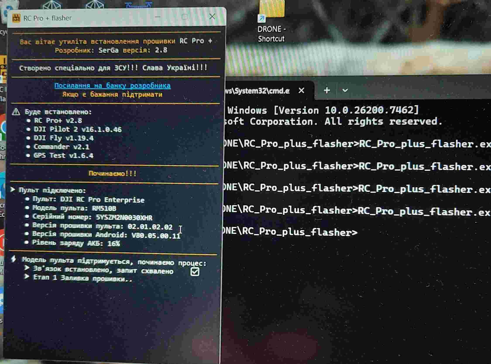
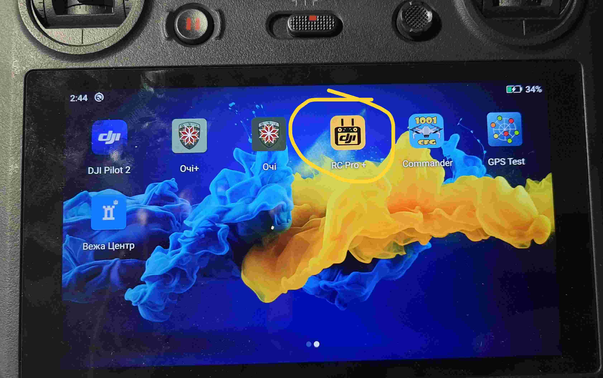
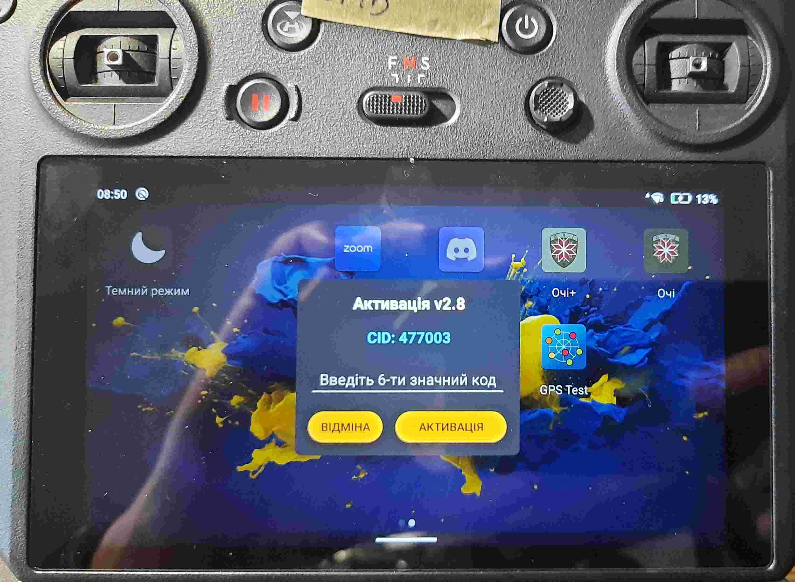
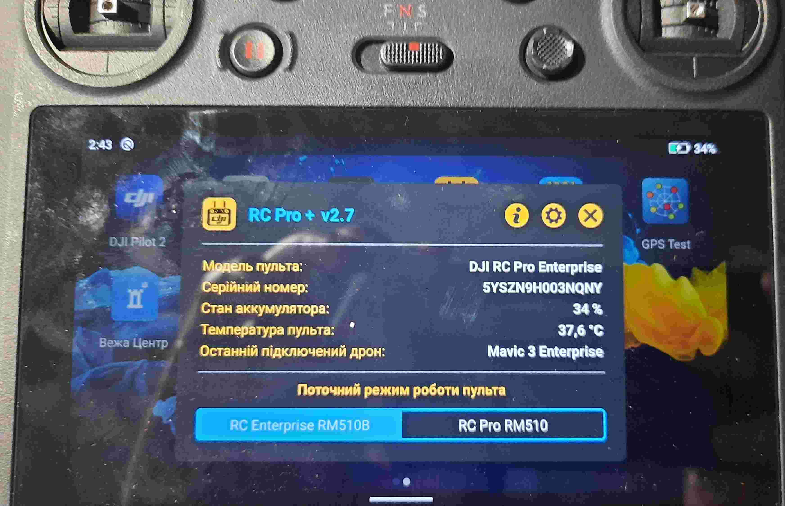

DJI RC Pro (RM 510)
===================
Для пультов серии RM 510 может применяться "патч" позволяющий переключаться между приложениями управления DJI Pilot и DJI Fly.

Порядок обновления
------------------
1) На пульте включаем wifi и подключаем его к ПК
2) На ПК запускаем предварительно установленное приложение "RC_Pro_plus_flasher.exe" (). Автоматически начнется обновление. 
    
   Если вылетело с ошибкой, перезапускаем пульт\ПК и повторяем операцию (VS Code не запускать!)
3) По окончанию прошивки перезагрузить пульт и запустить на пульте приложение RC Pro+
     

   Откроется окно с требованием ввода регистрационного кода
         

   В телеграм канале "RC Pro+" вводим номер CID из окна регистрации. В ответ получаем код регистрации.

   Если активация прошла успешно, откроется окно программы

         

4) Устанавливаем "вежу", "очі" https://drive.google.com/file/d/1lqZg3cQuBemOd8L6wrI69ng9aYoxkI0K/view?usp=sharing
   
   