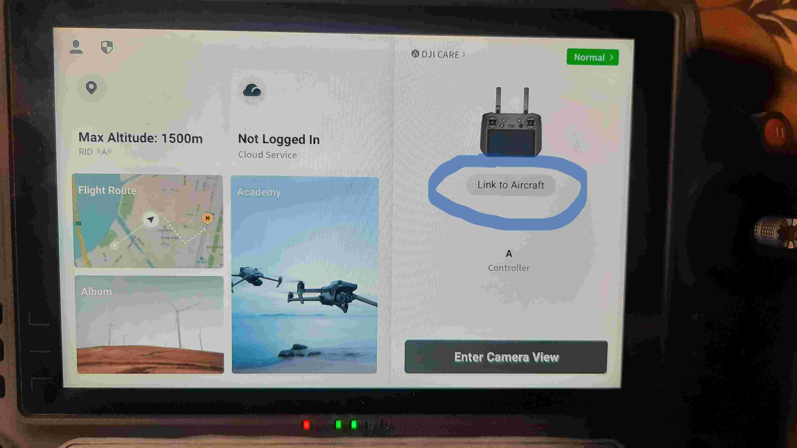
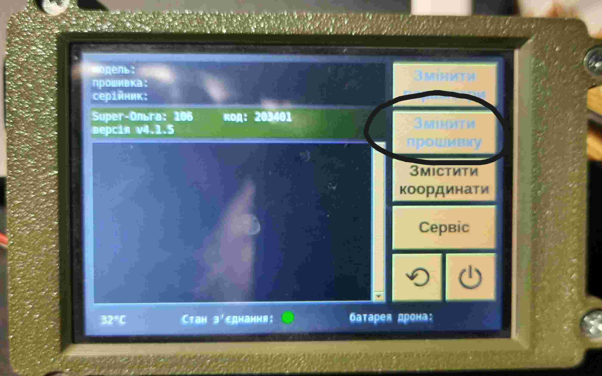
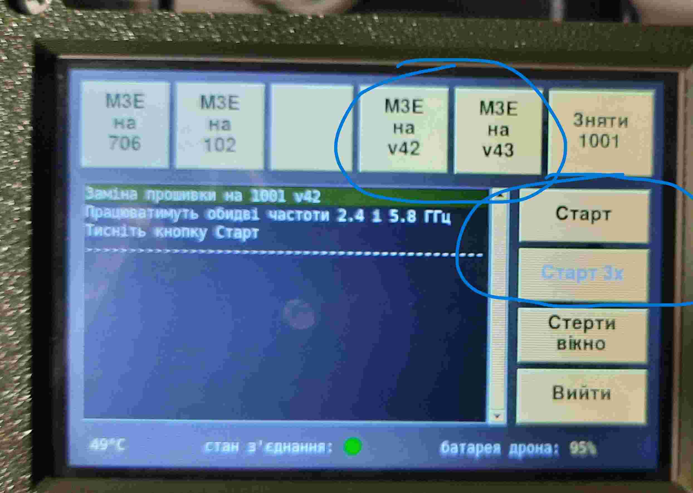
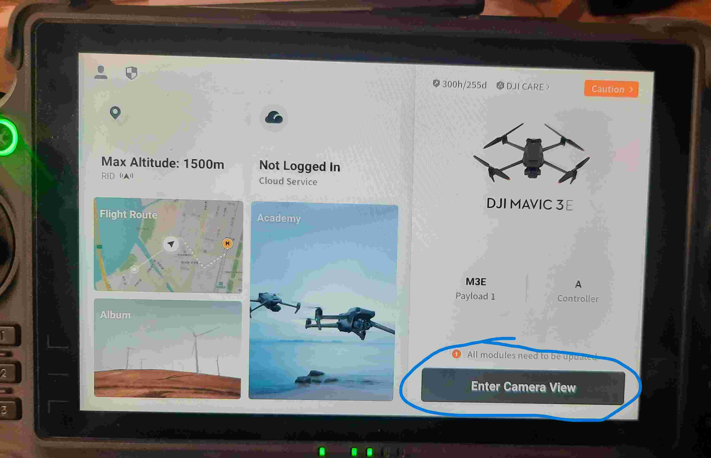
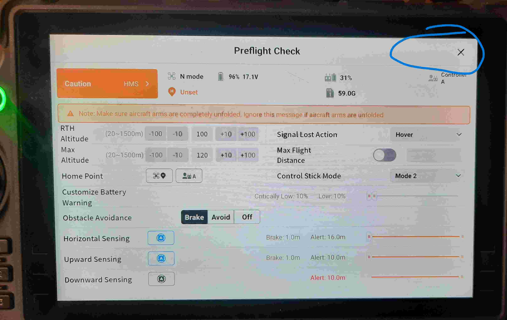
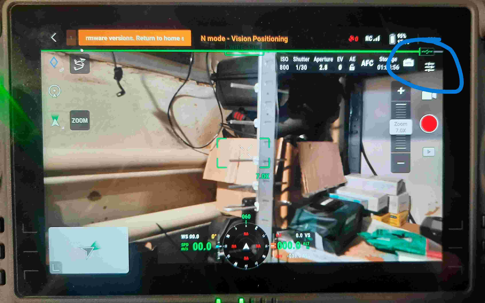
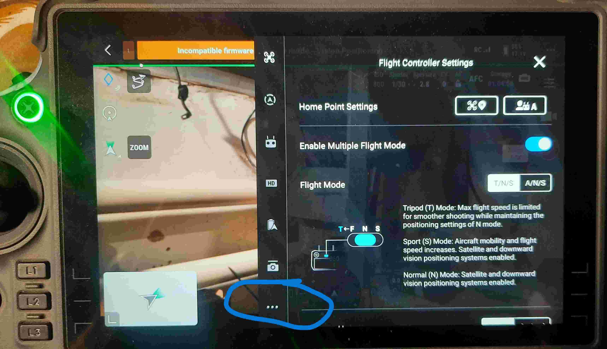
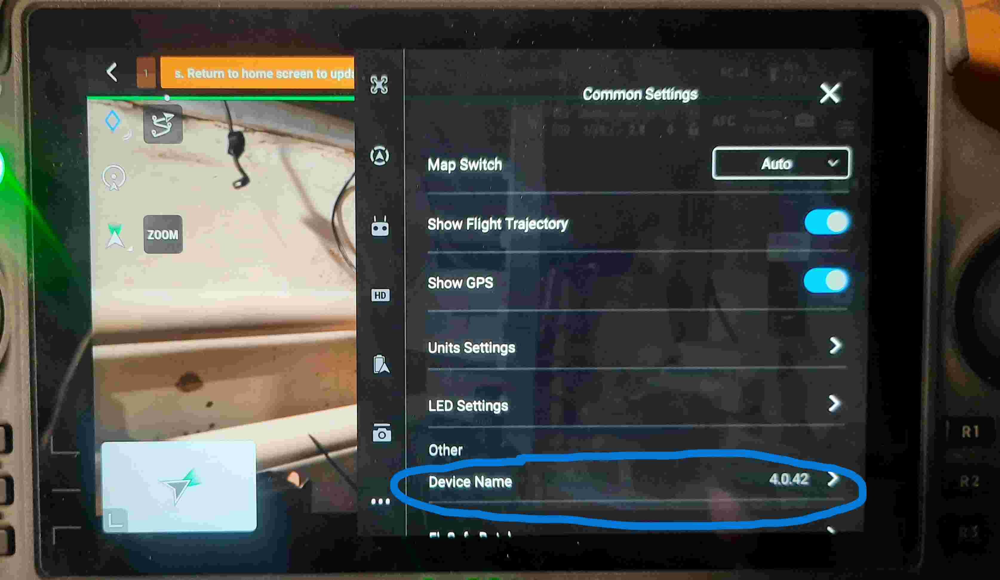
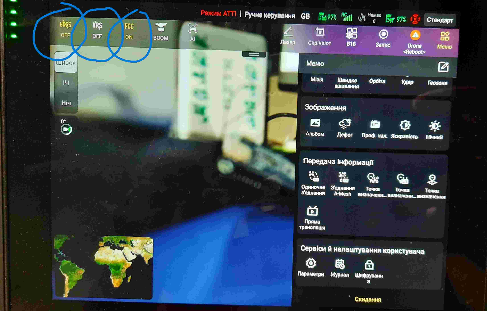
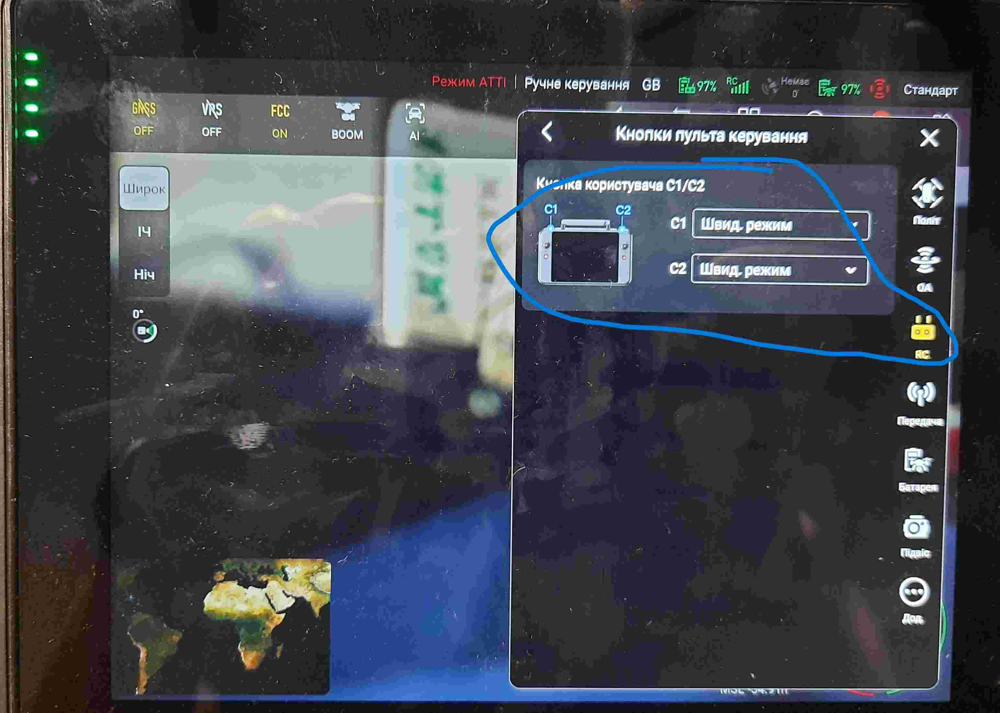

M3 T/E UPGRADE 1001
============
Данная прошивка позволяет **программно** отключить DroneID, ограничения беспелотных зон (NFZ), лимиты высоты\дальности, отключить ограничения мощности передающего сигнала (FCC). 

Поддерживаемые модели:
----------------------
Mavic 3, 3 Pro, 3T, 3E, 3М; Matrice 30 (M30) 

Прошивка дрона
-------------- 
1) Понижаем фабричную прошивку до: 09.02.0706
    * DJI Assistant 2 (Enterprise)

2) Делаем привязку дрон <-> пульт
    * На дроне зажимаем кнопку на 5sec до харктерного звука
    * На пульте 

2) Проверяем аккаунт
    * логинимся на пульте (unabomber22@tutanota.com Aa12345678$$)
    * 
    * выключаем пульт на всякий случай

3) Прошиваем на 1001 
    * Подключаем дрон к програматору (помним про охлаждение)
    * После инициализации выбираем "Змінити прошивку"
    

    * Если прошивка для разведки то v42, если для ретранслятора то v43
    * Старт 3х (если был уже прошит, то предложит просто Старт)
    

    В процессе прошивки прогроматор потребует отключиться от дрона. После этого прошивка продолжиться и требуется дождаться смены мигания светодиодов на батареи дрона, что будет сигнализировать о завершении прошивки.    
    
4) Маркером на дроне пишем 1001

Настройки на пульте
-------------------
1) Включаем пульт\входим в DJI Pilot2    
2) Подключаемся к дрону
3) Входим через режим "Camera View" в настройки
     
     
     
     
          
4) Вводим настроечные команды в поле Device Name
    * Команды должны обязательно оканчиваться запятой
    * Команды для теста: about, version,
    * Устанавливаемы команды зависят от решаемых задач и подверсий прошивки (v42 или v43)
    * Типовый пресет для v42 (задачи разведки): lost_500, bat_land_on, fcc_on
    * Типовый пресет для v43 (ретранслятор): lost_off, bat_land_on, fcc_off

5) Производим под. настройки
     
     
     
     
          
          

6) Выключаем пульт\дрон

